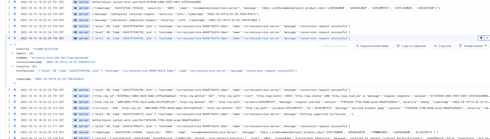
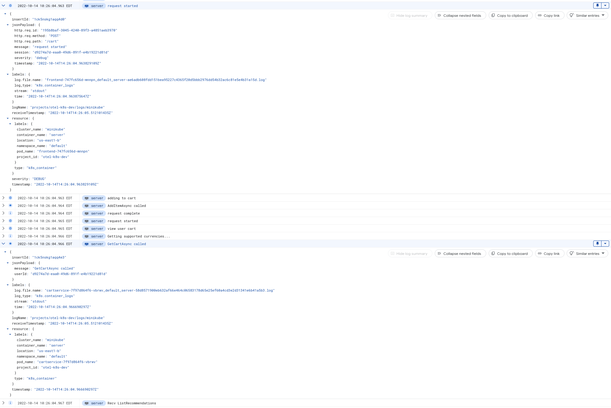

# Google Cloud Logging (Custom Parsing)

This example can be used to ship logs from any Kubernetes cluster to Google Cloud.

- [Objective](#objective)
- [How Does Custom Parsing Work?](#how-does-custom-parsing-work-)
- [Usage](#usage)
  * [Authentication](#authentication)
  * [Set Cluster Name](#set-cluster-name)
  * [Deploy](#deploy)
    + [Example Microservices](#example-microservices)
    + [Vanilla Configuration](#vanilla-configuration)
    + [Custom Configuration](#custom-configuration)

## Objective

In order to handle abitrary application logs, vanilla Kubernetes log parsing is generic in nature. Advanced users will
parse their individual application logs.

This example demonstrates how to parse individual application logs in a microservice environment, where each application has a
different timestamp, severity, and message format.

## How Does Custom Parsing Work?

An application running within a container will write a log to `stdout` or `sterr`. In this example, the log is structured
and contains useful fields such as `level` and `time`.

```json
{"level":30,"time":1665416957021,"pid":1,"hostname":"currencyservice-8448776d74-rpl9s","name":"currencyservice-server","message":"conversion request successful"}
```

The container runtime captures the stdout stream and writes the following to a file in `/var/log/containers`. For example, when using the `docker` container runtime, the `json-file` log driver (default log driver) will output something like this:

```json
{"log":"{\"level\":30,\"time\":1665416957021,\"pid\":1,\"hostname\":\"currencyservice-8448776d74-rpl9s\",\"name\":\"currencyservice-server\",\"message\":\"conversion request successful\"}\n","stream":"stdout","time":"2022-10-10T15:49:17.021137708Z"}
```

The docker runtime wraps the application's log with the following fields:
- log: Contains the raw application log
- stream: Stdout or sterr
- time: The time the log was captured from the application

When the `filelog` receiver reads a line from a file, the output entry looks like this:
- timestamp: nil
- severity: nil
- body: `{"log":"{\"level\":30,\"time\":1665416957021,\"pid\":1,\"hostname\":\"currencyservice-8448776d74-rpl9s\",\"name\":\"currencyservice-server\",\"message\":\"conversion request successful\"}\n","stream":"stdout","time":"2022-10-10T15:49:17.021137708Z"}`

The generic solution is to parse this entry with the `json_parser` and use the `time` field to set the entry's timestamp.
Next we move `attributes.log` to `body`, as the `log` field contains the actual application log and we no longer require 
the raw entry that is currently set to `body`.

```yaml
- type: json_parser
  parse_from: body
  parse_to: attributes
  timestamp:
    parse_from: attributes.time
    layout: '%Y-%m-%dT%H:%M:%S.%sZ'

- type: move
  from: attributes.log
  to: body
```

This will output the following log entry:
- timestamp: `2022-10-10T15:49:17.021137708Z`
- severity: nil
- body: `{\"level\":30,\"time\":1665416957021,\"pid\":1,\"hostname\":\"currencyservice-8448776d74-rpl9s\",\"name\":\"currencyservice-server\",\"message\":\"conversion request successful\"}`
- attributes:
  - stream: stdout
  - time: 2022-10-10T15:49:17.021137708Z

While this solution will work for **any application** running within the cluster, it may be ideal to parse the application
log further. To do this, we add custom parsing:

First, we implement a `router` operator, which will determine which operator to
forward the entry to based on the entry's pod name.

```yaml
- type: router
  default: add_log_type
  routes:
    - expr: 'resource["k8s.pod.name"] matches "currencyservice-*"'
      output: currencyservice_parser
```

Then we parse the application log with the json parser, leveraging the
embeded severity and timestamp parsers.

```yaml
- type: json_parser
  parse_from: body
  parse_to: body
  severity:
    parse_from: body.level
    mapping:
      info: 30
      warn: 40
      error: 50
  timestamp:
    parse_from: body.time
    layout_type: epoch
    layout: ms
```

This will output the following log entry:
- timestamp: `2022-10-10T15:49:17.021137708Z`
- severity: info
- body:
  - level: 30
  - time: 1665416957021
  - pid: 1
  - hostname: currencyservice-8448776d74-rpl9s
  - name: currencyservice-server
  - message: conversion request successful
- attributes:
  - stream: stdout

With the application log parsed, you are query for fields directly using the Google Log Explorer. The timestamp and severity displayed in the Google Log Explorer
will match the application log.

## Usage

Update the configuration to reflect your environment.

### Authentication

If running **outside of GCP**, deploy Google credentials:
```bash
kubectl create secret generic gcp-credentials \
    --from-file=credentials.json
```

### Set Cluster Name

Edit `daemonset.yaml` and update the cluster name environment variable. This is a "friendly" name that
can be searched on in the Cloud Logging interface.

```yaml
- name: K8S_CLUSTER
  value: minikube
```

### Deploy

#### Example Microservices

Deploy the custom application microservices:

```bash
kubectl apply -f custom-apps.yaml
```

#### Vanilla Configuration

Deploy the "vanilla" config map:

```bash
kubectl apply -f config.vanilla.yaml 
```

Deploy the collector daemonset:

```bash
kubectl apply -f daemonset.yaml
```

Notice that logs come into Google Cloud in their unparsed form with the `default` severity.



#### Custom Configuration

Next, deploy the "custom" config map

```bash
kubectl apply -f config.custom.yaml 
```

Restart the collector

```bash
kubectl rollout restart ds/observiq-otel-collector
```

Notice that logs come into Google Cloud in their parsed form. Severity and timestamp fields are set
correctly.


